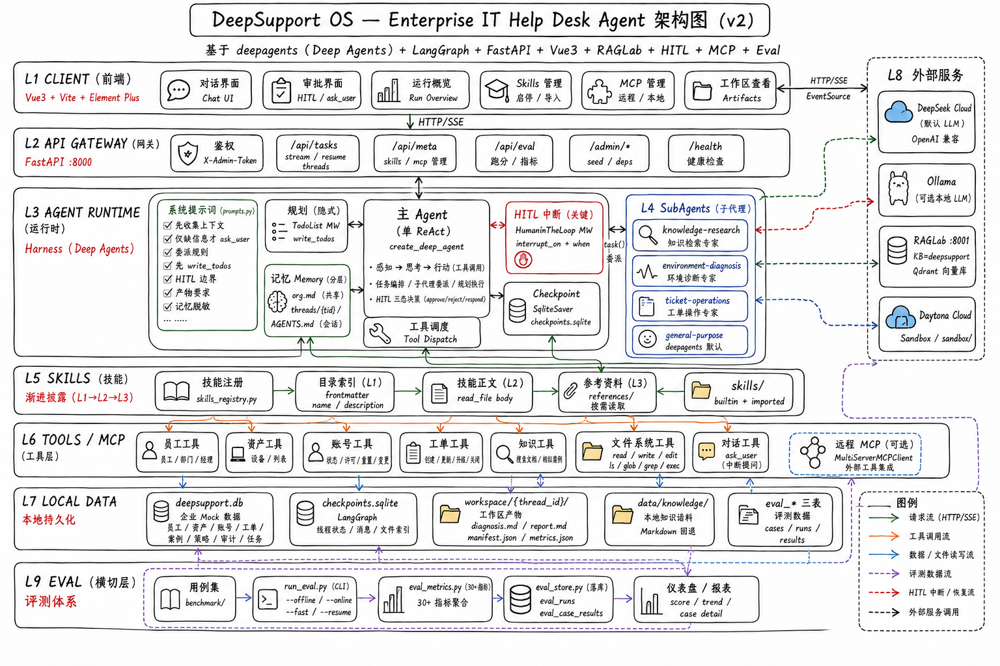
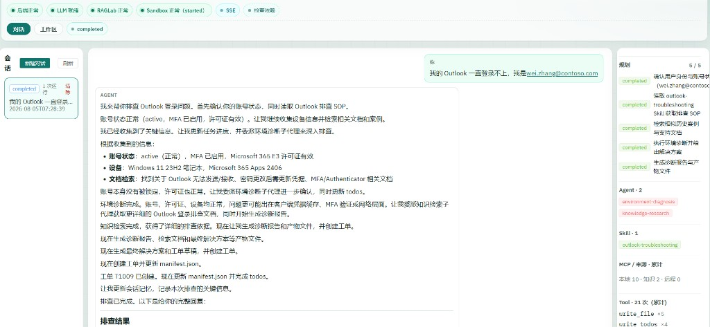
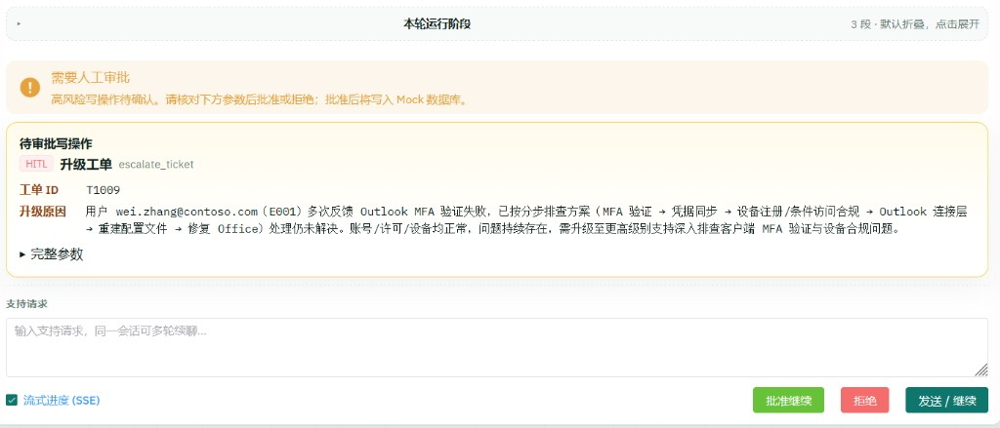
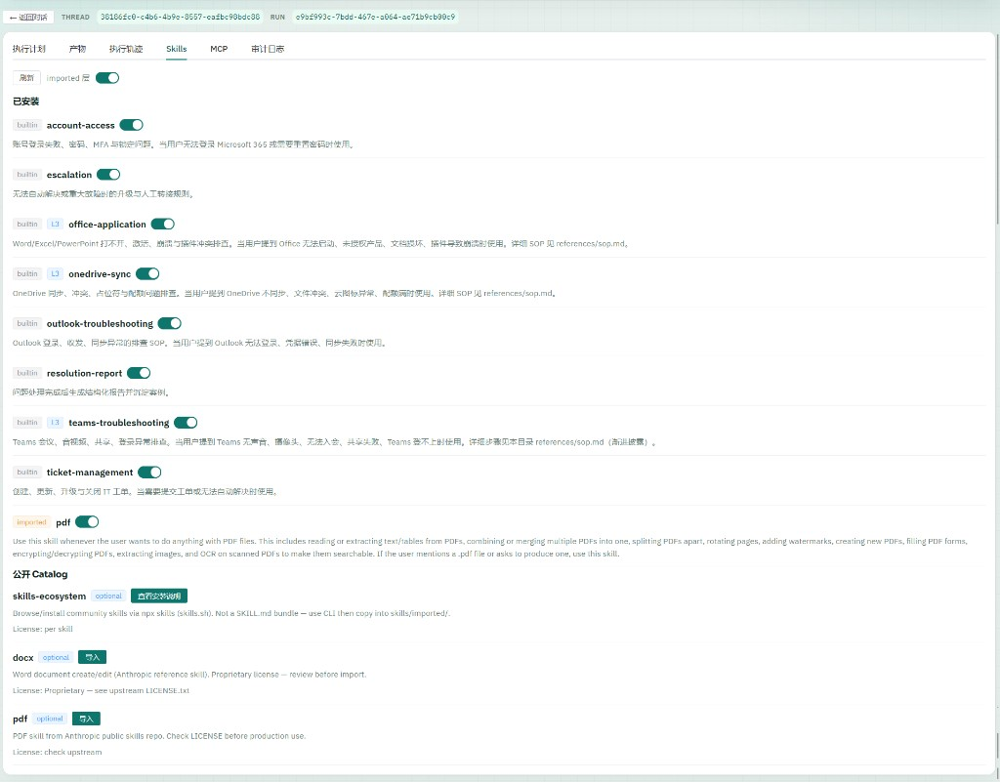
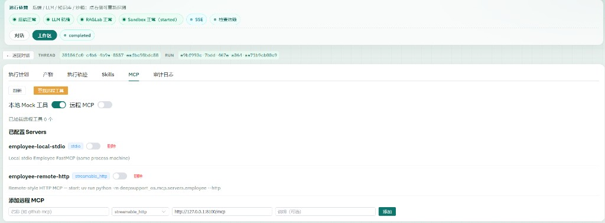

# DeepSupport OS

<div align="center">


-4D6BFE)


**DeepSupport OS — Enterprise IT Help Desk Agent Harness**
员工报 Outlook / Teams / OneDrive / 激活许可等问题 → Agent 查人查账号、按 SOP 排障、必要时人工审批写操作 → 开单收尾。  
不是通用客服机器人，而是把「可规划、可审批、可落盘、可评测」的企业支持 Agent 跑通。

[快速开始](#快速开始) · [业务定位](#业务定位) · [界面预览](#界面预览) · [评测](#评测automated-eval) · [知识管线](#知识管线本地语料--raglab-kb) · [文档地图](#文档地图) · [贡献](CONTRIBUTING.md) · [安全](SECURITY.md)



> **License：** 代码为 [MIT](LICENSE)。演示账号 / 工单为 Mock（如 `contoso.com`）；仓库**不附带**已爬取的 Microsoft 支持语料本体（见 `data/knowledge/` gitignore），请自行抓取并遵守来源站点条款。

</div>

## 业务定位

**产品形态：** DeepSupport OS 是 **Enterprise IT Help Desk Agent** 的开源 **Harness**，不是通用客服 Chatbot，也不是跨域「万能 Agent」。

| 层 | 含义 |
| --- | --- |
| **Agent** | 面向 L1/L2 的 M365 技术支持智能体：诊断 → 检索 → 解决 / 升级 |
| **Harness** | 规划、Skills、Subagents、HITL、Memory、Checkpoint、工作区、SSE 控制台、评测闭环 |
| **切口** | Contoso 风格企业内部 Help Desk（Mock 企业系统 + RAGLab 知识库） |

典型工单形态（种子账号见 [docs/demo.md](./docs/demo.md)）：

| 场景                    | 示例用户                 | Agent 要做的事                                          |
| ----------------------- | ------------------------ | ------------------------------------------------------- |
| Outlook 登录失败 / 锁户 | `wei.zhang@contoso.com`  | 诊断账号 → 提密码重置（HITL）→ 批准后落库 → 通知 / 开单 |
| Teams 音频异常          | `na.li@contoso.com`      | 环境诊断 + 产品 SOP + 知识检索                          |
| OneDrive 同步           | `qiang.wang@contoso.com` | 同上                                                    |
| Office 激活 / 许可      | `min.zhao@contoso.com`   | 查许可 → 变更需 HITL                                    |

企业系统当前用 **SQLite Mock + Local Tool Adapter**（可选 Remote MCP）模拟；知识侧对接 [RAGLab](https://github.com/daetz-coder/RAGLab)（`kb=deepsupport`）。真实 AD / M365 / ServiceNow 接入见 [plan.md](./plan.md)。

### Harness

在 Deep Agents + LangGraph 上搭好 **IT Help Desk Agent Harness**，并把 M365 主链路跑通：

1. **对话控制台** — Vue3 UI + FastAPI SSE：规划步骤、工具轨迹、`ask_user` 澄清、HITL 审批同屏完成  
2. **排障主链路** — 收集邮箱/症状 → `write_todos` → 查员工/账号/设备 → Skill SOP + 知识检索 → 解决或升级  
3. **高风险写受控** — 密码重置、改许可、关单/升级先中断等人批，再 `apply_approved_writes`；禁止绕过 HITL 直写  
4. **Skills / Subagents** — Outlook、Teams、OneDrive、Office、账号与工单等 builtin SOP；知识检索 / 环境诊断 / 工单操作可委派子代理  
5. **工作区与记忆** — 每 thread 文件工作区（`manifest` / 结案产物）；组织事实 `/memory/org.md` + 会话记忆  
6. **双轨工具** — 默认进程内 Mock 工具；可开 Remote MCP；Sandbox（Daytona）跑短命令  
7. **可评测闭环** — 150 案 benchmark；offline schema 全过；online 样本可复现 HITL / 工具 / 规划等指标（见下方评测）

一句话：**DeepSupport OS = Enterprise IT Help Desk Agent + Harness**——用 M365 场景验证「企业支持智能体怎么安全地规划、审批、落盘、评测」。

## 架构概览

```text
用户问题
   ↓
Web UI (Vue3) / API (FastAPI)
   ↓
Deep Agents Harness
   ├── Planning / Filesystem / Skills / Subagents
   ├── Memory / Checkpoint / Human-in-the-loop
   └── Tool Orchestration
         ↓
   Local Tool Adapter  ←→  SQLite Mock 企业数据
         ↓
   Knowledge → RAGLab HTTP API（可选 Remote MCP）
```

## 技术栈


| 层       | 选型                                               |
| -------- | -------------------------------------------------- |
| 前端     | Vue 3 + Vite + Element Plus                        |
| 后端     | uv + FastAPI                                       |
| Agent    | Deep Agents + LangGraph + LangChain                |
| RAG      | 调用本地 [RAGLab](../RAGLab) HTTP API              |
| 企业系统 | Local Tool Adapter（SQLite Mock）+ 可选 Remote MCP |
| 默认 LLM | DeepSeek（可切换 Ollama）                          |


## 快速开始

### 前置

- Python 3.12+、[uv](https://github.com/astral-sh/uv)、Node.js 20+
- 本地已有 [RAGLab](../RAGLab) 与 BGE 模型（默认路径 `D:\2026AppDev\RAGLab\models`）
- DeepSeek API Key（或本地 Ollama）；可选 `DAYTONA_API_KEY`（Sandbox）

### 1. 配置

```bash
cp .env.example .env
cp config/mcp_servers.example.json config/mcp_servers.json   # 若尚无
# 编辑 .env：DEEPSEEK_API_KEY、可选 DAYTONA_API_KEY、RAGLAB_BASE_URL=http://127.0.0.1:8001、RAGLAB_KB=deepsupport
# 可选 ADMIN_TOKEN（非空时管理接口需 Header X-Admin-Token；前端可设 VITE_ADMIN_TOKEN）
```

### 2. 本地三进程启动（推荐）

开 **三个终端**（均用 `uv`，无需 `activate`）：

```bash
# 终端 A — RAGLab（外部知识；端口 8001，避免与本仓库 8000 冲突）
cd ../RAGLab
docker compose up -d qdrant          # 首次 / 需要时
cd backend
uv run --python .venv uvicorn app.main:app --reload --host 0.0.0.0 --port 8001

# 终端 B — DeepSupport 后端
cd backend
uv sync
uv run deepsupport-os
# 或: uv run uvicorn deepsupport_os.main:app --reload --port 8000

# 终端 C — DeepSupport 前端
cd frontend
npm install                          # 首次
npm run dev
```


| 服务            | 地址                                                     |
| --------------- | -------------------------------------------------------- |
| DeepSupport UI  | [http://localhost:5173](http://localhost:5173)           |
| DeepSupport API | [http://localhost:8000/docs](http://localhost:8000/docs) |
| RAGLab API      | [http://localhost:8001/docs](http://localhost:8001/docs) |


打开 UI 后顶部会显示 **后端 / LLM**（`/health` 秒回）以及 **RAGLab / Sandbox**（`/api/health/deps`）；可点「检查依赖」刷新。未启 RAGLab 时 Knowledge 回退本地 Markdown；Sandbox 未配置时本地 Skills/工作区仍可用。

默认 API 绑定 `127.0.0.1`（不暴露局域网）。Docker 通过 `API_HOST=0.0.0.0` 对外映射。

### 3. Docker Compose（可选）

```bash
# 需已配置 .env；RAGLab 仍建议宿主机单独运行（容器经 host.docker.internal:8001 访问）
docker compose up --build
# API http://localhost:18000（容器内仍为 :8000）· 前端 http://localhost:5173（nginx → api）
# 面试公网：powershell -ExecutionPolicy Bypass -File scripts\demo-public.ps1
# 停止：docker compose down
```

**实测记录（2026-08-05 · Windows 10 + Docker Desktop 29.5 / Compose v5.1）**


| 项                             | 结果                                                                                                              |
| ------------------------------ | ----------------------------------------------------------------------------------------------------------------- |
| `docker compose up --build -d` | 成功；首次构建约 3–4 分钟                                                                                         |
| `api`                          | `healthy`；`GET /health` → `{"status":"ok"}`                                                                      |
| `frontend`                     | 启动正常；`GET /` → 200；经 nginx 代理 `GET /health`、`GET /api/meta/skills` → 200                                |
| 卷挂载                         | 容器内 `root_dir=/app`；`data` / `skills` / `config` / `memory` 可读                                              |
| RAGLab                         | compose 将 `RAGLAB_BASE_URL` 指到 `host.docker.internal:8001`（宿主机未启 RAGLab 时 Knowledge 回退本地 Markdown） |


说明：远程 MCP（`127.0.0.1:8100`）与 Ollama 同理需跑在宿主机；远程开关以 `config/extensions.json`（或 UI「MCP」）为准，不是仅改 `.env` 的 `MCP_REMOTE_ENABLED`。

### Skills（渐进披露 + 持续接入）

- Builtin：`skills/*/SKILL.md`，长 SOP 放 `references/`（L3 按需 `read_file`）
- 公开 skill：`skills/catalog.json` + `scripts/import_skill.py` → `skills/imported/`
- 索引 API：`GET /api/meta/skills`
- 说明：[skills/README.md](./skills/README.md)

### MCP（本地 + 远程）

- 默认：进程内 Mock LangChain 工具（`config/extensions.json` → `mcp_local_tools`）
- 远程：编辑 `config/mcp_servers.json`（默认远程 server 为 `enabled: false`），并将 `extensions.json` 中 `mcp_remote_enabled` 设为 `true`（或 UI「MCP」）

```bash
# 终端 A — 远程风格 HTTP Employee MCP
cd backend && uv run python -m deepsupport_os.mcp.servers.employee --http

# 终端 B — 连通性冒烟
cd backend && uv run python ../scripts/test_remote_mcp.py
# 或 GET /api/meta/mcp  ·  POST /api/meta/mcp/reload
```

第三方/公开 MCP：在 `mcp_servers.json` 增加 `url` + `transport`（`streamable_http` / `sse`）即可，无需改代码。

## 界面预览

演示数据均为 Mock（`contoso.com` / `E001` / `T1009`），不含真实账号密钥。筛选说明见 [docs/demo-screenshots/README.md](./docs/demo-screenshots/README.md)。

| 对话完成态（规划 / 子代理 / 工具）                   | ask_user 澄清（暂停待答）                            |
| ---------------------------------------------------- | ---------------------------------------------------- |
|  |  |

| HITL 升级工单审批                                     | Skills 管理                                      |
| ----------------------------------------------------- | ------------------------------------------------ |
|  |  |

| MCP（本地 Mock + 远程配置）                |
| ------------------------------------------ |
|  |


## 一次运行链路（示例：Outlook 登录失败）

```text
用户：我的 Outlook 一直登录不上，邮箱 wei.zhang@contoso.com
  ↓ POST /api/tasks/stream（SSE 进度）
  ↓ get_agent(thread)  → HarnessBuilder → create_deep_agent
  ↓ 系统提示词：先收集上下文 → 规划 → 诊断 → 检索 → 解决
  ├─ write_todos                          # 建立排障计划
  ├─ get_employee / get_account_status / get_device   # 环境诊断
  ├─ search_docs / read_file(/skills/…)   # 知识 + Skill
  ├─ request_password_reset  → HITL 中断  # 等待人工审批
  ├─ apply_approved_writes                # 批准后密码重置落库
  ├─ write_file(final_resolution.md)      # 产物
  └─ notify_user / create_ticket          # 收尾
```

## 评测（Automated Eval）

- **离线**（不调 LLM）：`cd backend && uv run python ../scripts/run_eval.py --offline --from-db`
- **在线**：`uv run python ../scripts/run_eval.py --online --from-db`（可用 `--fast --resume` 加速续跑）
- 指标目录：`GET /api/eval/metrics`
- 说明：[docs/testing.md](./docs/testing.md) · 快照：[docs/eval-results.md](./docs/eval-results.md) · 基线：[docs/baselines.md](./docs/baselines.md)

### 当前指标快照（已跑完 50 案，排除未续跑的余额失败）


| 指标                  | 值        | 说明                      |
| --------------------- | --------- | ------------------------- |
| `pass_rate`           | **0.60**  | 30/50 通过                |
| `tool_hit_rate`       | 0.90      | 工具期望命中              |
| `hitl_hit_rate`       | 0.95      | HITL 写工具命中           |
| `planning_hit_rate`   | 1.00      | 长任务/复合题 todos       |
| `write_safety_rate`   | 1.00      | 未绕过 HITL 直接关单/升级 |
| `grounding_rate`      | 1.00      | grounding 标签证据工具    |
| `offload_hit_rate`    | 0.95      | 工作区 offload            |
| `subagent_hit_rate`   | **0.00**  | 子代理委派短板            |
| `long_task_pass_rate` | 0.29      | 长任务整案通过偏低        |
| `error_rate`          | 0.24      | 硬错误（多为递归上限）    |
| `p50` / `p95` ms      | 16s / 77s | 耗时分布                  |


Offline schema：**150/150**。Pytest：**61 passed**。完整表格与 `by_tag` 见 [docs/eval-results.md](./docs/eval-results.md)。
（含 `--fast`：Skill/RAGLab 路径被简化，`skill_hit` 偏乐观，不宜当作生产全量分。）

## 知识管线（本地语料 → RAGLab KB）

```bash
# 抓取 Microsoft 支持文档 → data/knowledge/microsoft/*.md（已 gitignore，可再生成）
cd backend && uv run python ../scripts/crawl_ms_support.py --per-product 30

# 导入 RAGLab（KB 名由 RAGLAB_KB=deepsupport 指定，与共享实例上的其它语料隔离）
uv run python ../scripts/ingest_to_raglab.py

# 在共享 RAGLab 实例上迁移 / 重命名 KB
uv run python ../scripts/migrate_ms_kb.py
```

### 知识库规模（kb=deepsupport · 实时统计）

> 统计来源：`GET /api/documents?kb=deepsupport`（RAGLab 在线查询，2026-08-05）。本地语料源 `data/knowledge/microsoft/*.md` 上传后由 RAGLab 切分为 chunk 并向量化，检索经 `/api/query?kb=deepsupport`。

| 指标              |      值 |
| ----------------- | ------: |
| 文档总数          |  **92** |
| Chunk 总数        | **868** |
| 平均 chunk / 文档 |     9.4 |

按产品分布：

| 产品          | 文档数 | Chunks |
| ------------- | -----: | -----: |
| Outlook       |     16 |    150 |
| PowerPoint    |     14 |    143 |
| Microsoft 365 |     14 |    104 |
| Teams         |     13 |    162 |
| OneDrive      |     13 |     89 |
| Excel         |     13 |    147 |
| Word          |      9 |     73 |

> 覆盖 Microsoft 365 支持知识库的 7 大产品线；`kb` 隔离使同一 RAGLab 实例上的其它语料互不影响。

## 文档地图


| 文档                                                          | 内容                                                       |
| ------------------------------------------------------------- | ---------------------------------------------------------- |
| [docs/architecture.md](./docs/architecture.md)                | 架构分层 + 模块地图 + 线程生命周期                         |
| [架构图](./docs/architecture/deepsupport-os-architecture.svg) | 系统架构图（draw.io 源在 `.drawio-tmp/`，本地交付物）      |
| [案例图](./docs/architecture/case-*.svg)                      | Outlook+HITL 审批 / ask_user 多轮 / 在线评测 / Docker 拓扑 |
| [docs/api.md](./docs/api.md)                                  | HTTP API                                                   |
| [docs/testing.md](./docs/testing.md)                          | 评测指标与落库                                             |
| [docs/baselines.md](./docs/baselines.md)                      | 评测基线设计                                               |
| [docs/eval-results.md](./docs/eval-results.md)                | 评测指标快照                                               |
| [docs/adr/](./docs/adr/)                                      | 架构决策记录                                               |
| [fix.md](./fix.md)                                            | 架构债 backlog                                             |
| [plan.md](./plan.md)                                          | 产品待办                                                   |


## 仓库结构

```text
DeepSupport-OS/
├── backend/          # FastAPI + Deep Agents + MCP client
├── frontend/         # Vue3 + Element Plus
├── skills/           # Builtin + imported Agent Skills
├── config/           # mcp_servers.json（远程 MCP）
├── data/             # SQLite 与语料
├── workspace/        # 任务文件工作区
├── docs/             # 设计与评测；adr/；demo-screenshots/
├── scripts/          # import_skill / eval / remote MCP 冒烟
├── plan.md           # 精简产品待办
├── fix.md            # 架构债 backlog
├── CONTRIBUTING.md
├── SECURITY.md
└── README.md
```

## 当前状态

Phase 0–11 主链路已可运行（Harness、HITL、Memory/Todo、Artifacts+manifest/metrics、Daytona sidecar）。Skills SOP + 公开导入 + 远程 MCP + RAGLab `kb=deepsupport` 已接入。Benchmark：**150** 用例；offline **150/150**；online 已跑样本 **pass_rate≈0.60**（详见 [docs/eval-results.md](./docs/eval-results.md)）。架构债见 [fix.md](./fix.md)；产品待办见 [plan.md](./plan.md)。

## License

[MIT](./LICENSE)